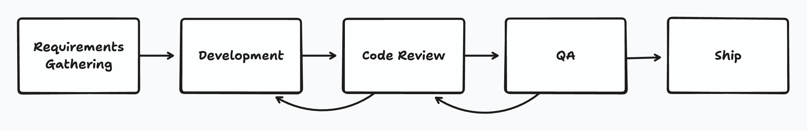
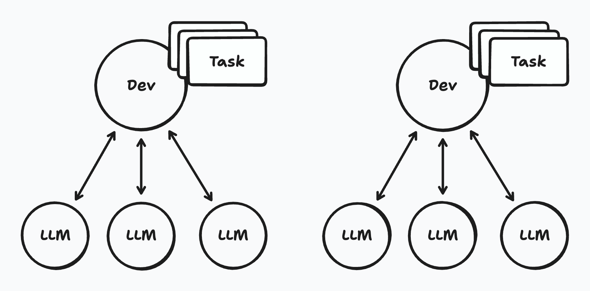
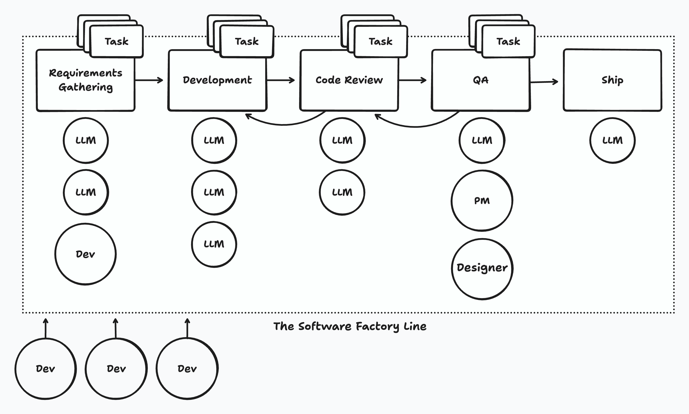

import NotebookLayout from "../../layouts/NotebookLayout.astro";
import NotebookArticleHeader from "../../components/NotebookArticleHeader.astro";

<NotebookLayout
  title={frontmatter.title}
  description={frontmatter.description}
>

<NotebookArticleHeader
  id={frontmatter.id}
  title={frontmatter.title}
  author={frontmatter.author}
  publishedDate={frontmatter.publishedDate}
  prevNote={{
    id: "WS008",
    title: "The Context Library of Alexandria (Part 1)",
    url: "/notebook/context-library",
  }}
/>

<article class="prose prose-blockquote:font-normal">
2026 will be the year that we stop hand-writing code and fully mechanize the process of software engineering.

This will lead to profound implications—second and third order effects that we can't yet see. Economic, social, organizational, emotional effects as the job that software engineers have been doing, more or less unchanged for 50 years, changes radically, seemingly overnight.

This might seem far-fetched. If you've been following recent projects in this space, the impression you get might be one of hype and chaos rather than clarity. Vaporware demos. Twitter threads claiming AGI.

But underneath the noise, something real is happening.

## Road to the Software Factory

Writing code professionally has always been treated as a process. The software development lifecycle (SDLC) has been studied and adapted over many decades. We've established best practices for what the different stages are and how those stages can be optimized for quality, throughput, effectiveness, and the general happiness of the people involved.

In the last three years, we've applied large language models to every stage—writing technical plans, writing code, performing code reviews, QA, architectural assessments. LLMs have gone from inconsistent assistants, to full-fledged junior developers, to effective engineers that can accomplish long-range tasks.

For those experimenting on the cutting edge, this has collapsed the timeline. When we know what needs to be built, it can be fully specified and implemented in a matter of hours—a 10x reduction. And we can run multiple agents in parallel: three, five, ten agents working on different tasks simultaneously.

Already, this change has brought turmoil and disruption. But we are far from fully embracing this as an industry—and the next step will be even more disruptive.

## The Paradigm Shift

You can understand the coming change with one simple mental model.

### The Old Model: Developers Shepherd Tasks

Today, developers take a single task all the way through the lifecycle. Developers who use LLMs configure them based on their preferences, like an extension of their IDE. But the task, the work they do, is _theirs_. Whether the developer or their LLM does the work, the developer is accountable for that task, shepherding it from start to finish.

### The New Model: Tasks Flow Through the Line

What's coming is different. We're going to stop thinking of developers as task-owners and start thinking of the _lifecycle itself_ as the product.

Imagine the SDLC as a literal factory line. Each stage—requirements, planning, implementation, review, testing, deployment—is a station. At each station, the same LLM configuration runs, optimized specifically for that stage's work. Tasks enter the line and flow through, station by station, until they emerge as deployed software.

Developers don't shepherd individual tasks anymore. Instead, they operate the line. They optimize stations. They intervene when something gets stuck. They're factory workers—highly skilled factory workers—but their relationship to the work has fundamentally changed.

There will still be a need for professional software developers—both to build the line itself and to staff stations where software agents can't yet meet the desired quality, or where human review is needed to ensure quality.

## What Software Factories Enable

### Compounding optimization

When every developer customizes their own LLM setup on their own machine, improvements stay local. If someone figures out a better prompting strategy, it helps them. Maybe they share it in Slack. Most people ignore it.

In a factory, improvements compound across the entire line. Optimize one station, and every task that flows through benefits. Every efficiency gain multiplies across every feature, every bug fix, every project.

This is why manufacturing ate craft production. Not because factory workers were more skilled than craftsmen—they were usually less skilled. But the system was better. The improvements accumulated.

### The SDLC evolution

We have been optimizing the software development lifecycle for 50+ years, but optimizing for _humans_. LLMs have different strengths and weaknesses. We should expect the SDLC to evolve around _those_.

One example we're already seeing: technical planning. Practitioners have begun using a step where an LLM proposes a detailed implementation plan and a human critiques it before any code is written. This stage barely existed three years ago. Now it's becoming mandatory in order to ensure quality outputs from LLMs when they write code.

As we operate these lines, we'll discover new stations we never knew we needed. The SDLC of 2030 will look nothing like the SDLC of 2020.

### Code becomes disposable

Here's an insight that changes how you think about all of this:

> Once an AI can reliably regenerate an implementation from specification, the code itself becomes an artifact of synthesis, not the locus of intent. 
> &mdash; Chad Fowler, [Provenance Is the New Version Control](https://aicoding.leaflet.pub/3mbp5ukeuzs22)

Code has always been the artifact we treasured. We version it. We review it. We refactor it lovingly. We build careers around writing beautiful code.

But in a software factory, code is just output. The valuable artifacts are upstream: the specifications, the requirements, the test suites that define correctness. The code can be regenerated at will. Throw it away and make more.

This is deeply counterintuitive if you've spent your career caring about code quality. And yet—it's liberating. The system that runs in production matters. The spec that defines what it should do matters. The code itself? Just an intermediate form.

## The Global Implications

We don't yet know the full implications for our world, but it's hard to see them as anything less than massive. An entire industry will be overturned.

### Efficiency beyond comparison

Individual developers using LLMs are already seeing 5-10x gains. But there's a ceiling—you run into human limits. How many agents can one person really supervise? How much context can one brain hold?

A factory line doesn't have the same limits. It can run continuously, at whatever parallelism you can afford, with consistent optimization across every station.

10x? Try 100x. We don't know the bounds yet—there are always physical limits—but I can't even guess what those boundaries will be.

Think of a man in a field with a scythe, diligently and expertly harvesting wheat. Now compare him to a factory farm with a hundred autonomous combine harvesters. It would be laughable if it weren't so sad.

### The end of a way of life

As these software lines become increasingly autonomous, we should expect they'll require fewer developers to build the same amount of software. [Jevons' Paradox](https://en.wikipedia.org/wiki/Jevons_paradox) suggests we'll probably just build more software for a time, until supply meets demand—at which point prices will plummet and we'll have a real change on our hands.

In the short term, we shouldn't expect software development jobs to go away, but merely to change. But the change is so radical that some software engineers will opt out.

What will opting out even mean? If you're already opting out from using LLMs, you're already massively behind your peers in productivity—and that gap will continue to grow. Eventually, opting out means opting out of the industry entirely.

I've grown up in this industry, working at different small software shops and on small teams as we handwrite software together. That world is going away. It will necessarily change to one of software line management.

The job of building software is going to change so radically as to be almost unrecognizable to someone who wrote code professionally back in the 2010s.

### Economics: pay to play

In the old world, the tools needed to write code were basically free. An individual developer could, by the sweat of their brow, write code without paying anyone for the pleasure of doing so.

In the new world, LLMs demand their token price, whether paid to labs per token, or to the electric company as you run a local LLM on your expensive GPU. The LLMs do not run on human calories. Software development will become a pay-to-play industry.

This means capital matters. The developers with the deepest pockets will move faster. Small indie teams can't out-spend Google. But factories become cheaper to operate over time—once the line is built and optimized, the per-unit cost drops. The startups that build out efficient factories first will have a massive advantage.

And factories don't sleep. Your mind has natural limits. It must rest when night falls. A factory line can run around the clock.

### Organizations Disrupted

Google employs some 50,000 software engineers. What will they do in this new world?

Set aside for a moment the difficulty of transitioning 50,000 people from their present job using a now-outdated method of software production. Assume we arrive in this new world in the blink of an eye—how will 50,000 people productively labor on software development factory lines?

This transformation will be slow, imperfect, and brutal. Factory-native startups—companies born into this new world, with org charts designed for software lines rather than software teams—will have enormous advantages.

The next Google might be ten people operating a finely-tuned factory.

### What will we build?

With capabilities to build software massively extended, and the cost of production dropping dramatically—what software will we choose to build?

Think of [Conway's Law](https://en.wikipedia.org/wiki/Conway's_law): you ship your org chart. With an organization that now looks like a factory line—highly parallel, largely autonomous—the nature of the software we ship will change.

SaaS has been the dominant software business model for decades, predicated on the economics of software companies and software production. In this new world, SaaS applications can be replicated in a week. But replication doesn't fully replace a functioning software product—software is more than code. It's also [the system that supports and operates that software](https://aicoding.leaflet.pub/3mbp5ukeuzs22) at scale.

Will SaaS continue to exist? Will it get more competitive? Cheaper? Will people write more bespoke software for individual use cases?

To this I can merely speculate that change will come, and that it will be no less massive than the changes to the nature of the work itself. I hope this has you thinking differently about your software job, and pondering what role you might want to play in this new world.

---

Thanks to Johannes Shickling for sending me down this path last July with [this tweet](https://x.com/schickling/status/1940368715297534356) and for the many conversations since:

> The era of manual software development is coming to a close quickly.
>
> My view on software development has drastically changed. I believe in the future the role of engineers will be to build software factories, not the software itself. So far programmers have been manual factory workers now quickly being replaced by more efficient and better robots.

Much gratitude to Geoffrey Litt, Danvers Fleury, and Chad Fowler for their thought partnership on this topic!

</article>

</NotebookLayout>
